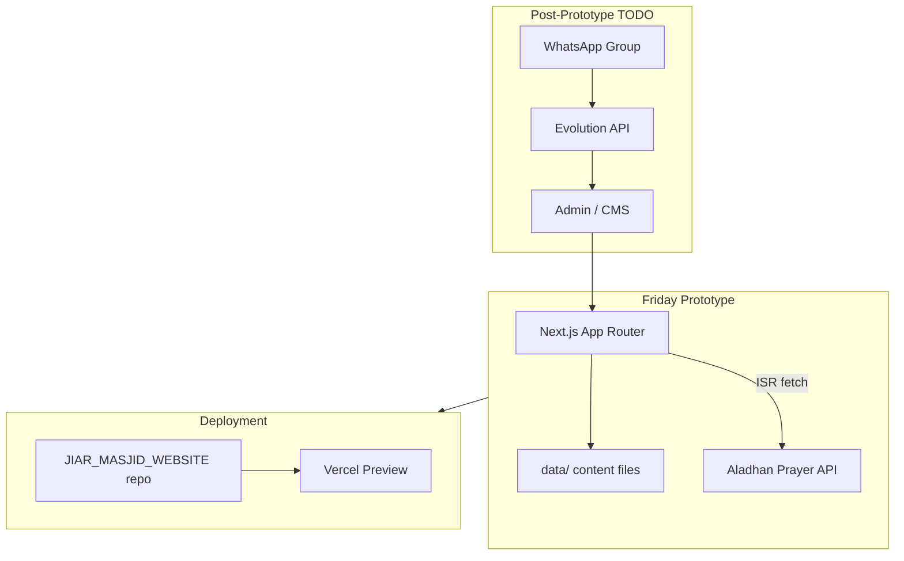
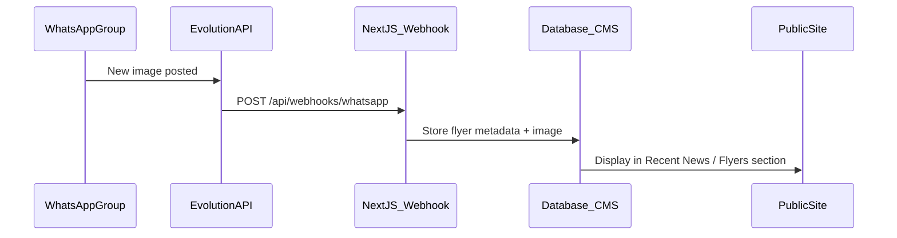

# JIAR Masjid Website — Friday Prototype Plan

## Goals (Sep 4)

| Deliverable | Status |
|---|---|
| Full site shell with real content from [ibadarrahman.org](https://ibadarrahman.org/) | In scope |
| Mobile-first UI inspired by Dribbble reference (green/orange, card layouts) | In scope |
| Combined prayer times table (Fayetteville + Parkwood) via Aladhan API | In scope |
| Donation page mirroring current content + external category links | In scope |
| Vercel preview URL (Malik's account, GitHub auto-deploy) | In scope |
| `docs/TODO.md` — admin, WhatsApp, roles, analytics, assets, domain | In scope |
| `docs/PRICE_ANALYSIS.md` — architecture/hosting options vs $38/mo DreamHost | In scope |

**Deferred (documented, not built Friday):** admin panel, Evolution API flyer automation, user roles, contact form, analytics, Arabic i18n, domain migration.

---

## Starting Point

- **Source template:** [`customizable-website-template`](/home/malik/GitRepositories/customizable-website-template) — Next.js 15, Tailwind 4, Resend contact form, Vercel config
- **Target repo:** [`JIAR_MASJID_WEBSITE`](/home/malik/GitRepositories/JIAR_MASJID_WEBSITE) (currently empty except README)
- **Approach:** Copy template into JIAR repo, then customize

---

## Site Architecture

---

## Design System

Adapt Dribbble reference to JIAR branding:

- **Primary:** Forest green (`#1B5E3B` range) — nav, primary CTAs
- **Accent:** Vibrant orange (`#E87722` range) — secondary CTAs, highlights
- **Typography:** Plus Jakarta Sans (already in template) or similar clean sans-serif
- **Components to build:** hero, prayer-times table, service cards, donation section, news list, scholar cards, project progress cards, mobile nav drawer
- **Logo:** Pull from current site for prototype; add TODO to download SVG/PNG into `public/`

---

## Page Structure (mirror ibadarrahman.org nav)

All pages exist with real content where scrapeable; thin/placeholder pages get "Content coming soon" with correct nav structure.

### Top-level routes

| Route | Content source |
|---|---|
| `/` | Hero, prayer times, services grid, recent news, Jumuah schedule, construction update |
| `/donate` | [Donation page](https://ibadarrahman.org/donation/) copy + external links per category |
| `/contact` | Phone, email, both masjid addresses (no form yet) |
| `/about` | About JIAR, history, board, bylaws, volunteer |
| `/about/imams` | Imam profiles |
| `/about/news` | Recent posts list |
| `/masjids/parkwood` | Parkwood location page |
| `/masjids/fayetteville` | Fayetteville St. location + renovation update |
| `/services/*` | Funeral, nikah, aqeeqah, dawah, forms, volunteer, sadaqah, live, Islam sub-pages |
| `/education/*` | Classes, Al-Misbah Academy, Al-Qalam Triangle Academy |
| `/membership` | Application + login placeholders |
| `/events` | Events calendar placeholder |
| `/gallery` | Photo gallery placeholder |

### Content migration strategy

1. Scrape/capture text from ibadarrahman.org pages into typed data files under `data/` (e.g. `data/locations.ts`, `data/services.ts`, `data/news.ts`, `data/donation.ts`)
2. Store news posts with title, date, excerpt, and link to full content (inline or `/about/news/[slug]`)
3. Pull donation category names and descriptions; external payment URLs scraped from current site header/nav donate links (Masjid Operation, Zakat, Sadaqah, etc.)
4. Download images from current site into `public/images/` (TODO item if time-constrained)

---

## Prayer Times (Aladhan API)

**Display:** Combined table matching current site — Athan and Iqamah columns for both Fayetteville and Parkwood side by side.

**Implementation:**

- Create `lib/prayer-times.ts` — fetch from [Aladhan API](https://aladhan.com/prayer-times-api) using masjid coordinates:
  - Parkwood: `5122 Revere Rd, Durham, NC 27713`
  - Fayetteville St.: `3034 Fayetteville St, Durham, NC 27707`
- Use calculation method consistent with current site (likely ISNA or MWL — verify against current times once live)
- Apply configurable **iqamah offsets** in `data/prayer-config.ts` (admin-editable later)
- Server component with `revalidate: 3600` (hourly ISR)
- Friday Jumuah schedule as static data (from current site: Parkwood 3 shifts, Fayetteville 1 shift)

---

## Key File Changes

| File / Area | Purpose |
|---|---|
| [`data/site.ts`](data/site.ts) | JIAR name, tagline, description |
| [`data/locations.ts`](data/locations.ts) | Both masjid addresses, phones, maps URLs |
| [`data/navigation.ts`](data/navigation.ts) | Full nav tree matching current site |
| [`data/donation.ts`](data/donation.ts) | Categories + external payment URLs |
| [`data/news.ts`](data/news.ts) | Recent posts from current site |
| [`lib/site-config.ts`](lib/site-config.ts) | Extend for multi-location support |
| [`lib/prayer-times.ts`](lib/prayer-times.ts) | Aladhan API integration |
| [`components/site-header.tsx`](components/site-header.tsx) | Full nav + mobile drawer + Donate CTA |
| [`components/prayer-times-table.tsx`](components/prayer-times-table.tsx) | Combined 2-masjid table |
| [`app/globals.css`](app/globals.css) | JIAR green/orange theme tokens |
| [`app/page.tsx`](app/page.tsx) | Homepage sections per Dribbble layout |
| [`app/donate/page.tsx`](app/donate/page.tsx) | Donation content + category links |
| [`docs/TODO.md`](docs/TODO.md) | Deferred features backlog |
| [`docs/PRICE_ANALYSIS.md`](docs/PRICE_ANALYSIS.md) | Hosting/architecture cost comparison |

---

## Deployment

1. Push `JIAR_MASJID_WEBSITE` to GitHub
2. Connect repo to Malik's Vercel account
3. Set env vars: `NEXT_PUBLIC_SITE_URL`, `NEXT_PUBLIC_PHONE`, `NEXT_PUBLIC_EMAIL`, location addresses
4. Resend keys optional for Friday (contact form deferred)
5. Share preview URL with Yunus + JIAR board

---

## Price Analysis Outline (`docs/PRICE_ANALYSIS.md`)

Compare monthly cost vs current **$38/mo DreamHost + Wix**:

| Option | Stack | Est. Monthly | Pros | Cons |
|---|---|---|---|---|
| **A — Static Prototype** | Vercel Hobby + Aladhan API + Git content | $0 | Cheapest, fast, reliable | Content changes require dev |
| **B — CMS-First** | Vercel Pro ($20) + Sanity free tier | $20 | Non-technical editing, preview | CMS learning curve, vendor lock-in |
| **C — Full Custom** | Vercel Pro + Supabase ($25) + custom admin | $25–45 | Full control, roles, flyers DB | Most dev time upfront |
| **D — Automation-Heavy** | Option C + Evolution API (self-hosted VPS ~$6–12) | $30–55 | WhatsApp flyer pipeline | Ops overhead, WhatsApp ToS risk |
| **E — Current** | DreamHost $38 + Wix | $38+ | Known quantity | Expensive, limited UX, vendor lock-in |

Include one-time migration costs, Stripe fee note (2.9% + $0.30 if donations move in-house later), and recommendation matrix for JIAR board decision.

---

## TODO Doc Backlog (`docs/TODO.md`)

Items explicitly deferred per your answers:

1. **Branding assets** — Download JIAR logo/SVG from current site into `public/`
2. **Admin panel** — Non-technical posting for news/flyers (evaluate Sanity vs Payload vs custom)
3. **User roles** — Admin, youth team, editor permissions (RBAC design)
4. **WhatsApp flyer automation** — Evolution API (instance exists) → webhook → publish flyer to site
5. **Contact form** — Resend integration to admin@ibadarrahman.org
6. **Analytics** — GA4 or Vercel Analytics for 31k mobile / 11k desktop tracking
7. **Arabic i18n** — next-intl or similar
8. **Domain migration** — ibadarrahman.org DNS from DreamHost → Vercel
9. **DreamHost/Wix access** — Content audit, donation URL inventory, redirect map
10. **Hosting budget** — Board decision on target monthly spend
11. **Donation URL audit** — Confirm all 8 category external payment links
12. **Prayer iqamah admin override** — UI to adjust offsets per masjid without code deploy

### WhatsApp automation spec (for TODO)

---

## Risk / Assumptions

- Donation external URLs may require DreamHost/Wix access to confirm — use scraped links where visible, placeholder + TODO otherwise
- Some ibadarrahman.org sub-pages have thin or duplicate content; prototype uses best-effort migration
- Evolution API WhatsApp automation is spec-only for Friday (instance exists but not wired)
- Yunus design files not blocking — Dribbble reference is sufficient for prototype polish

---

## Success Criteria (Friday)

- [ ] Preview URL loads on mobile with full navigation
- [ ] Homepage shows hero, prayer times (live API), services, news, Jumuah schedule
- [ ] Both masjid location pages with correct addresses/phones
- [ ] Donate page with current copy + category external links
- [ ] All nav links resolve (no 404s)
- [ ] `docs/TODO.md` and `docs/PRICE_ANALYSIS.md` committed
- [ ] Lighthouse mobile score target: 85+ (performance acceptable with ISR + optimized images)
