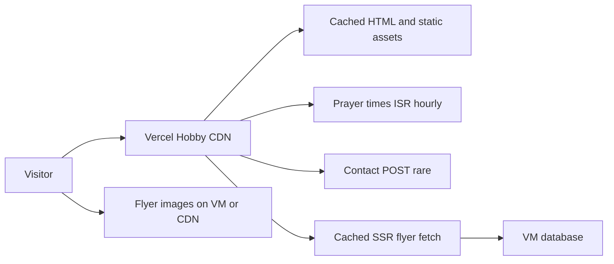

# Host this site on Vercel Hobby

**Short answer:** No — ~42k unique visitors a month will not hit Vercel Hobby limits for the site as it is today. Start on Hobby, watch the dashboard, and upgrade to Pro (~$20/mo) only if a meter approaches a cap or you want a no-pause guarantee.

This is a recommendation only. No deploy or code changes in this pass.

## What the current $38 is (DreamHost vs Wix vs domain)

The **$38/month is not the domain**. A domain is ~$10–20 **per year**. $38/mo is a **DreamHost hosting (and likely email) bill**.

[docs/PRICE_ANALYSIS.md](docs/PRICE_ANALYSIS.md) and [docs/TODO.md](docs/TODO.md) treat the current stack as **DreamHost $38/mo + Wix (separate, amount unknown)**. There is no invoice in this repo, so:

- **DreamHost $38:** website hosting for the live WordPress-style site at ibadarrahman.org (and probably mailboxes). Not Wix, not the domain fee.
- **Wix:** a second product if they still pay it. The docs mark it as “if separate / varies.” It does **not** host on DreamHost; Wix hosts its own builder sites. Confirm on the actual card/invoice.
- **ibadarrahman.org:** registration/DNS, cheap and yearly. DreamHost often bundles year-1 domain into hosting; after that it is a small annual renew.

Moving to Vercel Hobby removes the **hosting** line. Keep paying whoever owns the **domain** (~$15/yr) and any **email** that still lives on DreamHost.

## What you are hosting

[jiar-masjid-website](app/page.tsx) is a Next.js 15 App Router site: mostly static pages, a small contact API ([app/api/contact/route.ts](app/api/contact/route.ts)), and hourly-cached Aladhan prayer fetches ([app/lib/prayer-times.ts](app/lib/prayer-times.ts)). Public assets are tiny (~104 KB; hero image ~72 KB).

Traffic number used: **~42k unique users/month** (31k mobile + 11k desktop from [docs/PRICE_ANALYSIS.md](docs/PRICE_ANALYSIS.md)). Later: SSR-cached flyer JSON from a **VM database** (not Supabase / not a Vercel DB). Images for those flyers should be served from the VM or a cheap object/CDN host, not through Vercel Image Optimization.

## How likely you hit a cap

**Overall: very unlikely.** Chance of a *site-pausing* Hobby cap in a normal month is about **5–15%**, and almost all of that is bots inflating **edge requests**, not human traffic or bandwidth. Functions and transfer have a large cushion.

Assumptions used: **42k unique users**, ~2 sessions/user/month (prayer-time checkers come back), ~2 pages/session, first load ~300–450 KB (Next.js JS + font + 72 KB hero + 12 KB logo), repeat visits mostly cached, homepage ISR via `revalidate: 3600`, two `next/image` files, flyer JSON cached later with images **off** Vercel.

- **Fast Data Transfer (100 GB):** expect **20–40 GB** typical, ~60 GB pessimistic (Ramadan + bots). Headroom ~2–4x. **Very low chance (~2–5%)**.
- **Edge requests (1M):** expect **250k–500k** from humans, **600k–900k** if crawlers/scrapers are loud. **Low–moderate chance (~10–20%)** — this is the closest real meter.
- **Function invocations (1M):** low thousands (hourly prayer ISR, contact POSTs, flyer revalidate). Headroom ~100x. **Negligible (<1%)**.
- **Active CPU (4 hrs):** minutes, not hours, while ISR/CDN cache holds. **Negligible (<1%)** unless cache is broken.
- **Image transformations (5k):** a handful of sizes for logo + hero, then cached. **Negligible now**; **high later** if flyer photos go through `next/image`.
- **Image cache reads (300k):** ~80k–160k for 2 images × 42k users. **Low (~5–10%)**.
- **Web Analytics (50k events):** 42k users × multiple pageviews **exceeds 50k** if you turn it on. **High (~70%+)** — pauses *analytics only*, not the site.

Ramadan or a news spike at **2× traffic** still fits transfer and functions. Edge requests are the one meter that could *approach* 1M in a noisy month. That is the number to watch, not bandwidth.

Hobby is free. If you exceed a hard cap, **the deployment pauses** until the next ~30-day window. You cannot buy extra usage on Hobby. That is the only real operational risk.

## Policy (gray area you accepted)

Hobby is written as personal / non-commercial. Official fair-use text treats **asking for donations** as commercial. You are unpaid volunteer, keeping Donate (Mohid/PayPal links), and accepting that gray area. Community replies have treated unpaid nonprofit + donate as OK; that is not a contract. If Vercel ever flags the project, the fix is Pro, not a rewrite.

## How to host it (do this)

1. **Deploy on Vercel Hobby** as already outlined in [docs/03-vercel.md](docs/03-vercel.md): GitHub import, Next.js preset, env vars from `.env.example`, custom domain when you cut over.
2. **Turn on usage emails** in the Vercel dashboard (approaching 75–80% of Fast Data Transfer, Edge Requests, Function invocations, Image transformations).
3. **Do not enable Vercel Web Analytics / Speed Insights** unless you accept those event caps. They are not required for the site to run.
4. **When flyers land:** fetch JSON on the server with `revalidate` (minutes, not every request). Point `` / `next/image` at the VM or a dedicated image host. Do not proxy flyer binaries through Vercel.
5. **Upgrade trigger:** move to **Pro ($20/mo, usage continues instead of pause)** if any meter hits ~80%, if a bot/scrape event pauses you once, or if you later want team seats / guaranteed uptime. Pro is insurance, not a traffic necessity at 42k users.

## What would change the answer

- Serving many large flyer images or video **from Vercel** (bandwidth + image transforms).
- Uncached SSR to the VM on every pageview (CPU + invocations).
- A traffic spike far above ~42k (Ramadan campaign, news hit) plus aggressive bots.

None of those apply to the current site. Hobby is the right host for now.
